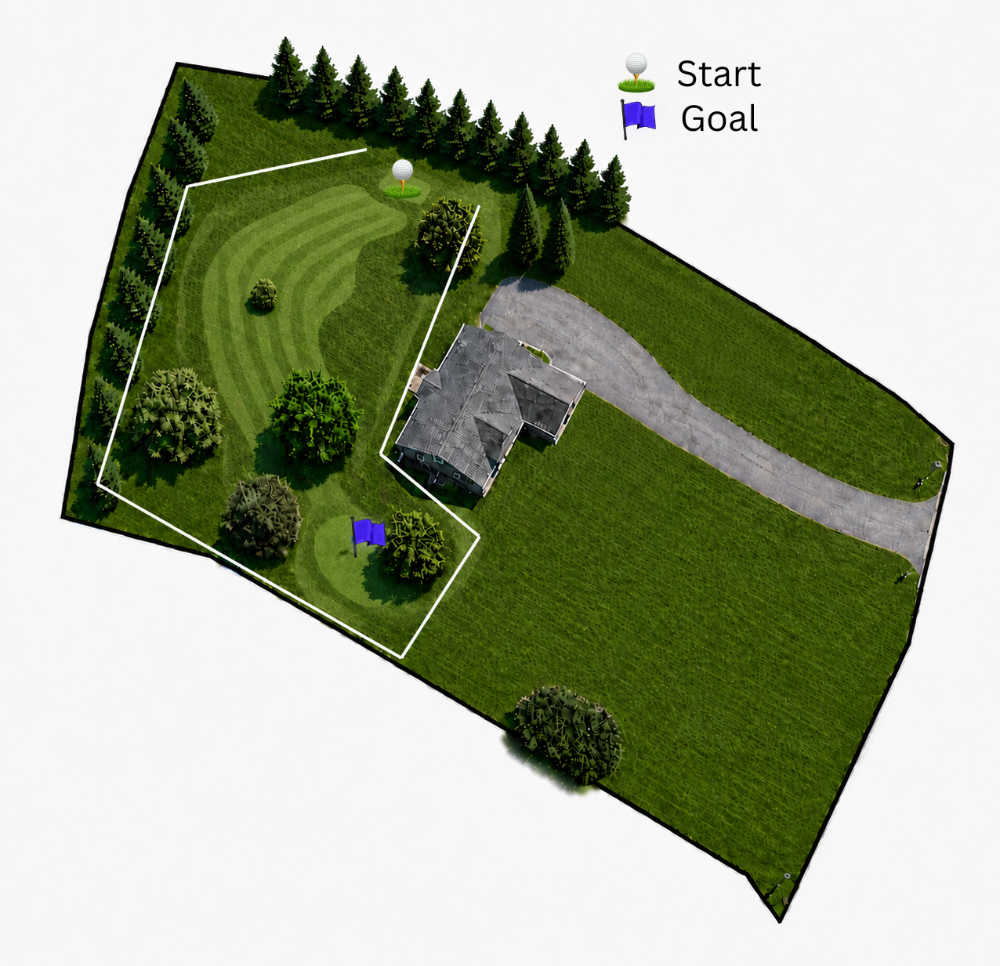

# ⛳ Rzeznik Golf Course

**A homemade 6-hole backyard golf course — and a little experiment in turning a
silly game into a data project.**

We built a par-19 golf course in a backyard, made up some house rules, and play it
as a *best-ball scramble*. This repo is everything around that: a phone-friendly
app for logging rounds on the course, a clean data pipeline, and a set of machine
learning models that try to predict how a round will go.

It's a personal project, but it's all here in the open. If you've got a backyard, a
driveway, or a park and a sand wedge, you can **fork this and track your own
course** — the code doesn't care whose holes they are.

---

## What's in here

| | |
|---|---|
| 📱 **A tap-to-log web app** | One HTML file. Open it on your phone, play a round, tap what each shot did. No app store, works offline. |
| 📊 **A clean data pipeline** | Every shot is one row in a CSV. Team scores are *derived*, never hand-entered, so the numbers can't drift. |
| 🤖 **Four ML models** | Predict team score, win probability, hole difficulty, and individual shot outcomes. |
| 💬 **A stats caddie** | A separate little chat app — ask plain-English questions ("which hole is hardest?") and a local server answers from the data. It never makes numbers up. |
| 🗺️ **A real course** | Six holes with start/target landmarks, generous pars, and safety routing so balls stay out of the neighbors' yards. |

---

## The course (par 19)

| Hole | Par | Start | Target | Notes |
|------|-----|-------|--------|-------|
| 1 | 3 | Behind the pear tree | Behind the side pine | |
| 2 | 2 | Where hole 1 ends | Behind the brush well | No line of sight |
| 3 | 3 | Back-left tree, by the pine | Behind the pear tree corner | No line of sight |
| 4 | 4 | Top of the lawn by the sidewalk | Between back-left tree & porch tree | Hooks around house; **first shot lefty only** |
| 5 | 3 | Where hole 4 ends | Back-right corner, 10 ft off the small pine | Safety routing |
| 6 | 4 | Where hole 5 ends | Front tree on the Murray side (hole is left of it) | Curves around house |

Full definitions live in [`data/course.yaml`](data/course.yaml). **Making your own
course?** Just rewrite `course.yaml` and the matching `COURSE` block at the top of
`webapp/index.html`.

<p align="center">
  
  <br>
  <em>Hole 1 (par 3) — tee off behind the pear tree (⛳ Start) and finish behind the side pine by the house (🚩 Goal). More hole maps are landing in <a href="maps/README.md"><code>maps/</code></a>.</em>
</p>

---

## How we play (the house rules)

It's a **best-ball scramble** for 1–4 players on one team:

- 🏌️ **One club only.** The sand wedge is the only legal club — so we don't bother
  tracking club choice.
- 🔁 **Everyone hits from the same spot** each stroke. The team keeps the **best
  ball**, and all players hit the next stroke from there. The person who hit the
  kept ball goes first; a **random player starts each hole**.
- 🎯 **What a shot can do:** *grounder, short pop, good, **hole**, overshoot,* or
  *out of bounds*. A `hole` ends the hole right away. Your **team score** for a
  hole is just the number of strokes it took.
- 🏆 **You win** when the team total beats the **target** (the par total, 19). Set
  `target_score` in `course.yaml` to change it.
- 🪃 **One mulligan per round** for the whole group — a free do-over of a single
  shot. The scrapped shot doesn't count.
- 🚫 **Out of bounds can't be kept.** If *everyone* goes OB, the team re-hits the
  same spot (it still costs a stroke). It's a safety rule to keep balls off the
  neighbors' lawns.
- ⏭️ **Skip a turn.** Someone has to sit out a stroke? Tap **skip** — it's not a
  real attempt, can't be the best ball, and (in a group) doesn't cost the team an
  extra stroke.
- 🤏 **Pars are intentionally generous** (a par 3 where the perfect line is really
  a 2). That nudges players to lay up instead of firing risky shots over fences.

---

## Logging a round on your phone

Day-to-day, you capture rounds with the tap-based web app in
[`webapp/index.html`](webapp/index.html) — a single file, no install:

1. **Get it on your phone once.** Either enable **GitHub Pages** on your fork and
   open `…/webapp/`, or just email `webapp/index.html` to yourself and open it in
   your phone's browser. Then **Add to Home Screen** — it runs offline after that.
2. **Pick who's playing.** You're added by default; tap the **✕** next to anyone
   sitting this one out, or **＋ Add** a friend by name.
3. **Play.** A big banner always shows the **hole, its par, and which stroke
   you're on**. The app names whose turn it is — tap one outcome button and it
   advances to the next player. After everyone hits, it asks **who had the best
   ball**. Mulligan, Skip, and Undo are all one tap away. Everything is saved in
   the browser, so a locked screen won't lose your round.
4. **Finish → send it to yourself** (email / share / copy the round data).

Back at a computer, import what you sent:

```bash
python scripts/import_log.py round.json     # a saved/emailed file
python scripts/import_log.py                 # …or paste the JSON, then Ctrl-Z + Enter (Windows)
```

It assigns IDs, creates any new players, appends to the CSVs, and validates the
round against the scramble rules.

> Prefer a keyboard? `python scripts/log_round.py` is an interactive terminal
> logger that does the same thing.

---

## Getting set up (for the data + ML side)

```bash
git clone https://github.com/T-Rzeznik/RzeznikGolfCourse.git
cd RzeznikGolfCourse

python -m venv .venv
.venv\Scripts\activate          # Windows PowerShell
# source .venv/bin/activate     # macOS / Linux
pip install -r requirements.txt
```

**No real rounds yet?** Generate synthetic data to try the whole pipeline:

```bash
python scripts/generate_sample_data.py      # writes fake data to data/sample/
jupyter notebook notebooks/01_explore.ipynb
```

---

## How the data is structured

The **per-shot table** ([`data/shots.csv`](data/shots.csv)) is the single source of
truth — one row per player per stroke. Everything else (team scores, win/loss) is
*computed* from it in code, so the numbers can never disagree with each other.

```
data/
  course.yaml   # the 6 holes: par, start/target, dogleg, blind, map
  players.csv   # roster
  rounds.csv    # one row per game (date, who played, conditions)
  shots.csv     # one row per player per stroke   ← source of truth
```

Each shot records `stroke_num` (the team's stroke index), `shot_order` (who hit
first), `outcome`, `distance` (how far the team was from the target on that
stroke — `tee`/`long`/`mid`/`short`/`tap_in`, the bit that makes a shot *easy or
hard*), `best_ball` (was this ball kept?), `mulligan` (a scrapped do-over), and a
`ts` timestamp. Each round also captures optional `ground` (dry/wet) and `wind`
conditions. The outcome vocabulary and the full "scramble invariant" that every
scoring rule follows from live in [`golf/schema.py`](golf/schema.py).

**The pipeline guards your data.** Every round carries a stable `client_round_id`,
so re-importing the same export can't create a duplicate. The importer also
*validates a round before writing it* — a round that breaks the scramble
invariant is quarantined to `data/quarantine/`, never appended to the CSVs. The
invariant (and these guards) are covered by [`tests/`](tests/) — run
`python -m pytest -q`.

---

## The `golf` package & the ML models

```python
from golf import data, features

# Derived scorecards (always consistent with shots.csv)
data.hole_scores()           # team strokes per (round, hole)
data.round_scores()          # team total per round + did we beat the target
data.player_contributions()  # per player: shots, best balls, outcome counts
data.validate()              # list of data problems ([] means clean)

# Leakage-free feature tables for the four modeling goals
features.score_prediction()  # predict the team's strokes on a hole
features.win_probability()   # predict the team beats the target
features.hole_difficulty()   # which holes play hardest
features.shot_outcome()      # predict an individual shot's outcome
```

The `golf` package only guarantees clean, leakage-free tables. The actual modeling
(train/test splits, metrics, experiments) lives in `notebooks/` so it's easy to
iterate without touching the data layer.

---

## 💬 Ask the caddie (the stats chatbot)

The **caddie** is a *separate* little app — a chat where you ask plain-English
questions about the rounds you've logged and it answers: *"who's got the best
make-rate?"*, *"which hole is hardest?"*, *"who's more likely to make a tap-in?"*.

> **Two apps, on purpose.** The **logger** ([`webapp/index.html`](webapp/index.html))
> is the offline phone app you tap rounds into — it never needs a server. The
> **caddie** ([`webapp/caddie.html`](webapp/caddie.html)) is this chat. They're kept
> separate so the logger stays dead-simple and works anywhere.

It's built **brain + mouth**: the **brain** ([`golf/stats.py`](golf/stats.py))
computes every number from `shots.csv` (make-rates with small-sample smoothing, so
a 1-for-1 doesn't read as a bragging 100%); the **mouth** (Google Gemini) only
*narrates* what the brain returns via tool-calling — it can't invent a stat. Thin
data is flagged, so the caddie hedges honestly ("…but that's only 2 rounds").

The caddie needs a tiny **local server** on your laptop (to hold the API key and
read the data); your phone reaches it over the same wifi.

**One-time setup**

```bash
pip install -r requirements.txt        # adds fastapi, google-genai, qrcode, etc.
copy .env.example .env                 # Windows  (cp on macOS/Linux)
# paste your Gemini key into .env — free key at https://aistudio.google.com/apikey
```

**Run it — just double-click `Caddie.bat`** (or the **Rzeznik Caddie** desktop
shortcut). It starts the server and pops open a **launch page** with a **QR code**:

- 💻 **On the laptop:** click **"Open the caddie here →"**.
- 📱 **On your phone:** point your camera at the **QR code** — the caddie opens
  right up. (No typing IP addresses.)

Closing the launcher window stops the caddie. *(Prefer the terminal? `python
run_server.py` does the same thing.)*

> **Phone won't connect?** It's almost always the **Windows Firewall** — the first
> run pops a prompt; click **Allow access** (Private networks). Also make sure both
> devices are on the *same* wifi (not a guest network), and the laptop isn't on a VPN.

The caddie only knows **historical** data (the rounds you've imported with
`import_log.py`), not a round you're currently logging. Costs are tiny — it uses a
cheap Gemini Flash model (`gemini-2.5-flash`), only when you ask a question. Change
it with `GEMINI_MODEL` in `.env`.

---

## Make it your own

This is built around one specific backyard, but nothing in the code is hardcoded to
it. To track your own course:

1. Rewrite the holes in [`data/course.yaml`](data/course.yaml) and the `COURSE`
   block in [`webapp/index.html`](webapp/index.html).
2. Set your roster in [`data/players.csv`](data/players.csv).
3. Adjust the house rules to taste — the outcome list and target score are the main
   knobs.

---

## Status & roadmap

This is an early, for-fun experiment — expect rough edges, and feel free to open an
issue or fork it.

- [x] Phone web app for logging rounds (hole/par/stroke display, skip, undo, mulligan)
- [x] Data schema, validation, and derived scorecards
- [x] Feature tables for all four ML goals
- [x] Stats caddie chatbot (brain in `golf/stats.py`, Gemini "mouth", local server)
- [ ] Teach the caddie the *live* round, so it can answer "who should hit this shot?" mid-round
- [ ] Add hole map images to `maps/` (hole 1 done — 5 to go)
- [ ] Measure and fill in `yards` for each hole in `course.yaml`
- [ ] Log enough real rounds to train baseline models
- [ ] Baseline models + write-ups in `notebooks/`
- [ ] (Later) optional weather/conditions capture

---

*Built for fun in a backyard. If you end up playing your own version, that's the
whole point.* 🏌️
